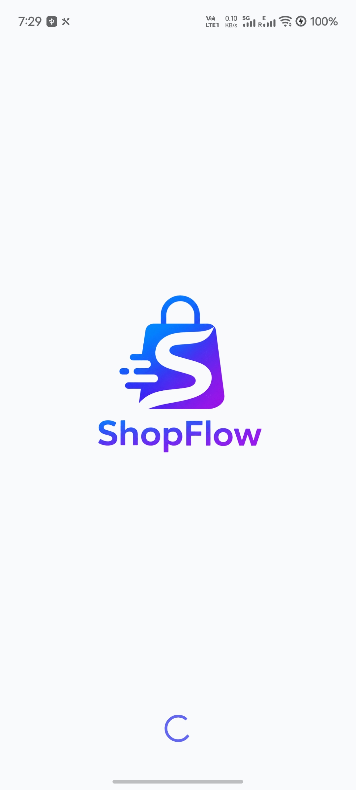
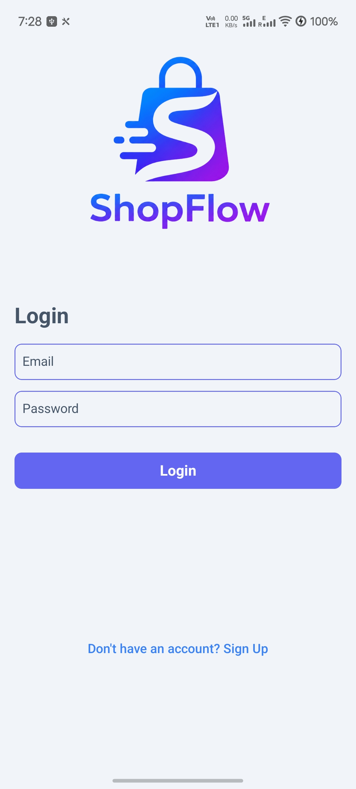
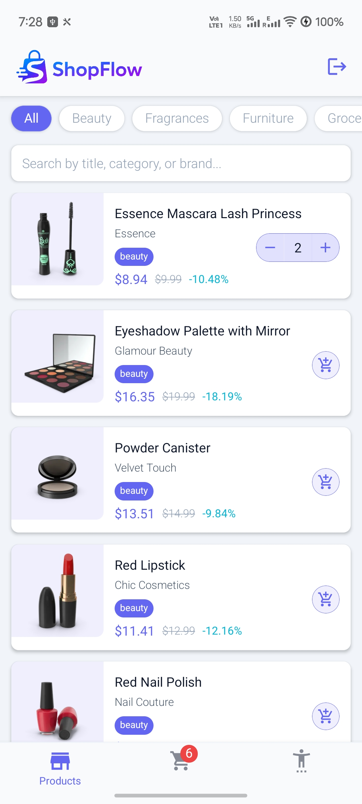
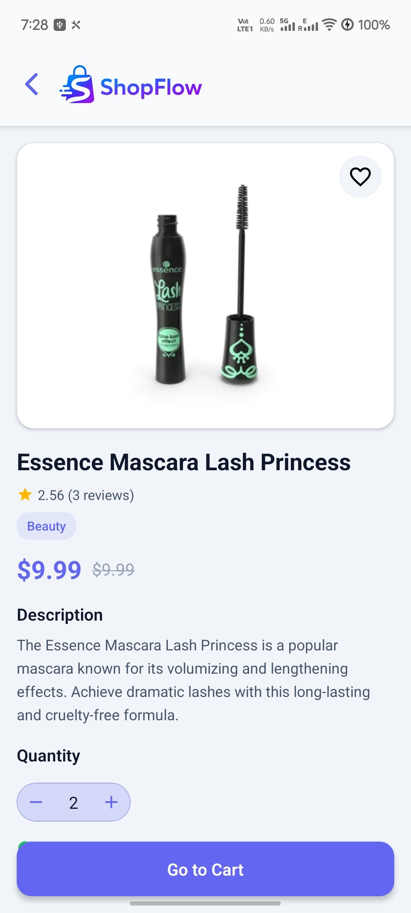
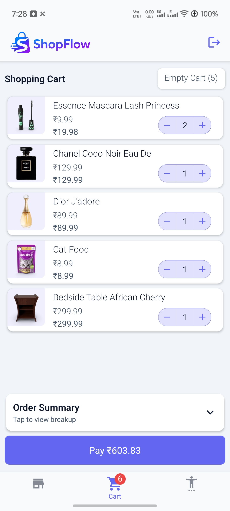
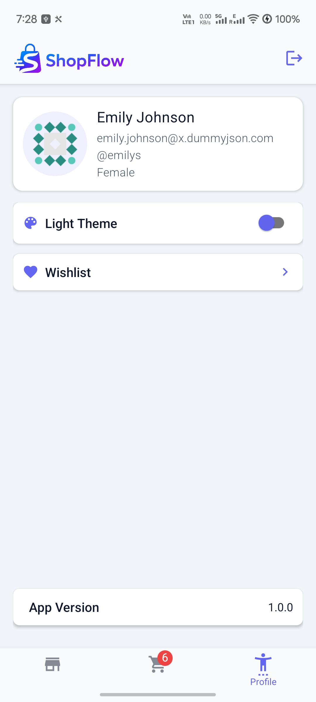

<p align="left">
  
</p>

A modern React Native shopping application built with **React Native**,
**TypeScript**, **Redux Toolkit**, **RTK Query**, and **React
Navigation**.

ShopFlow was created as a portfolio and learning project to demonstrate
production-ready React Native architecture, authentication, server state
management with RTK Query, client state management with Redux Toolkit,
reusable UI components, and modern development best practices.

> **Status:** 🚧 Active Development

------------------------------------------------------------------------

# 📱 Demo

> 


------------------------------------------------------------------------

# 📸 Screenshots

>      
 

------------------------------------------------------------------------

# ✨ Features

## Authentication

-   Login using RTK Query
-   JWT Authentication
-   Access Token & Refresh Token handling
-   Protected Navigation
-   Redux Persist authentication state
-   Automatic Authorization Header
-   Logout functionality

## Products

-   Product Listing
-   Product Details
-   Search Products
-   Category Filter
-   Pull To Refresh
-   Loading & Empty States
-   Reusable Product Card Component
-   API response transformation using RTK Query

## Cart

-   Add Product to Cart
-   Update Quantity
-   Remove Product
-   Persist Cart
-   Order Summary
-   UPI Deep Link Integration
-   Total Price Calculation

## Theme

-   Light Theme
-   Dark Theme
-   Theme Persistence
-   Dynamic Colors

## State Management

-   Redux Toolkit
-   RTK Query
-   Redux Persist
-   Typed Hooks
-   Typed Navigation
-   Custom Base Query
-   Automatic Authorization Headers

------------------------------------------------------------------------

# 🏗️ Architecture

``` text
src
│
├── app
│   ├── hooks.ts
│   ├── store.ts
├── assets
├── components
├── features
│   ├── auth
│   ├── cart
│   ├── products
│   └── theme
├── hooks
├── navigation
├── screens
├── services
├── theme
└── App.tsx
```

------------------------------------------------------------------------

# 🧠 Tech Stack

### Mobile

-   React Native
-   TypeScript

### State Management

-   Redux Toolkit
-   RTK Query
-   Redux Persist

### Navigation

-   React Navigation
-   Native Stack
-   Bottom Tabs

### Networking

-   RTK Query
-   fetchBaseQuery
-   Custom baseQuery

### Storage

-   AsyncStorage

### UI

-   React Native
-   React Native Vector Icons
-   Safe Area Context

------------------------------------------------------------------------

# 📡 APIs Used

### Authentication

-   Login
-   Current User
-   Refresh Token

### Products

-   Products List
-   Product Details
-   Product Categories

------------------------------------------------------------------------

# 🔐 Authentication Flow

``` text
Login
  │
  ▼
Access Token
  │
  ▼
Redux Persist
  │
  ▼
prepareHeaders()
  │
  ▼
Authenticated API Calls
```

------------------------------------------------------------------------

# 📦 RTK Query Features Used

-   createApi
-   fetchBaseQuery
-   Custom baseQuery
-   prepareHeaders
-   Query Hooks
-   transformResponse
-   API Caching
-   Auto-generated Hooks

------------------------------------------------------------------------

# 🧩 Redux Toolkit Features Used

### Slices

-   Auth Slice
-   Cart Slice
-   Theme Slice

### Concepts

-   Reducers
-   Actions
-   Immer
-   Selectors
-   Typed Hooks
-   Redux Persist

------------------------------------------------------------------------

# 🎨 UI Features

-   Responsive Layout
-   Search
-   Category Chips
-   Loading Indicators
-   Empty State
-   Pull To Refresh
-   Dark Mode
-   Reusable Components

------------------------------------------------------------------------

# 💳 UPI Payment

The Cart module demonstrates UPI deep linking for initiating payments
from supported UPI applications.

Supported apps include:

-   Google Pay
-   PhonePe
-   Paytm
-   BHIM
-   Amazon Pay (UPI)

------------------------------------------------------------------------

# 🚀 Getting Started

## Clone Repository

``` bash
git clone https://github.com/ashish-lonare/shopflow.git
```

## Install Dependencies

``` bash
npm install
```

## iOS

``` bash
cd ios
pod install
cd ..
npm run ios
```

## Android

``` bash
npm run android
```

------------------------------------------------------------------------

# 📚 Learning Objectives

This project was created to gain hands-on experience with:

-   React Native
-   TypeScript
-   Redux Toolkit
-   RTK Query
-   Redux Persist
-   JWT Authentication
-   React Navigation
-   Modular Architecture
-   Production-ready Mobile Development

------------------------------------------------------------------------

# 🚧 Upcoming Features

-   Infinite Scroll Pagination
-   Product Reviews
-   Wishlist
-   Checkout Flow
-   Order History
-   Address Management
-   Push Notifications
-   Firebase Analytics
-   Offline Support
-   Unit Testing
-   Detox E2E Testing
-   CI/CD Pipeline

------------------------------------------------------------------------

# 👨‍💻 Author

**Ashish Lonare**

Senior Mobile Application Developer

-   React Native
-   Flutter
-   Android
-   TypeScript
-   Redux Toolkit

GitHub: https://github.com/ashish-lonare

------------------------------------------------------------------------

# ⭐ Support

If you found this project helpful, please consider giving it a ⭐ on
GitHub.
